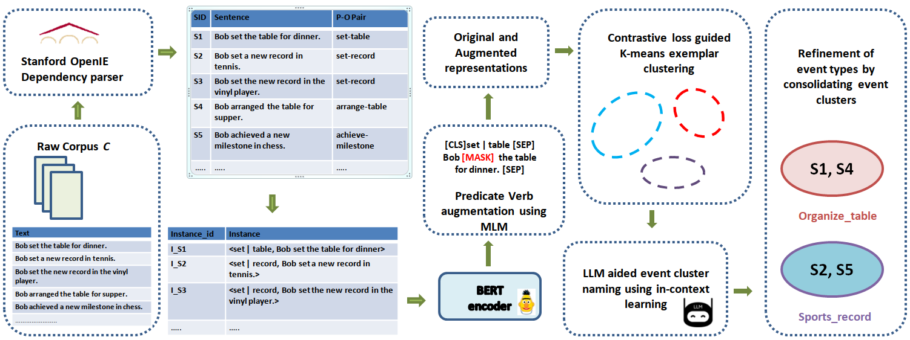

# CLUE: A Contrastive Learning Framework for Unsupervised Event Type Induction and Annotation


<p align="center">
  
</p>

<p align="center">
  <em>
    Overview of CLUE framework
  </em>
</p>

## Prerequisites

CLUE requires the following as below:

- Python and the libraries specified in project requirements
- Stanford OpenIE library for predicate–object extraction
- TextEE library for event-data preprocessing


Please make sure to download each dataset from its official source and put the corresponding training JSON file in the `data/` directory.

## Running CLUE

Run the scripts in order:

```bash
python extract_po.py
python create_instances.py
python create_masked_instances.py
python augment_verbs.py
python prep_filter_kmeans.py
python kmeans_exemplar.py
python centroid_selection.py
python ename.py
python edef.py
python merge_names.py
python merge_clus.py
```

### Dataset-specific prompts

Please modify the LLM scripts as for dataset:

- `ename.py`: generates event-type names for the induced clusters.
- `edef.py`: generates fine-grained definitions for the induced event types.
